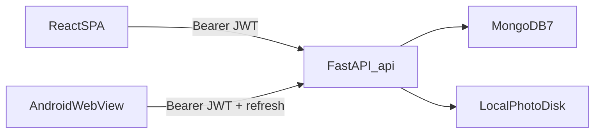
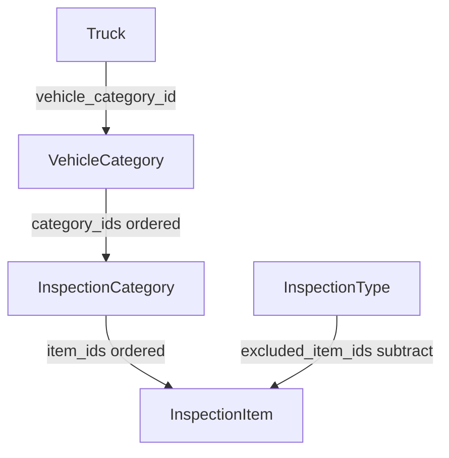
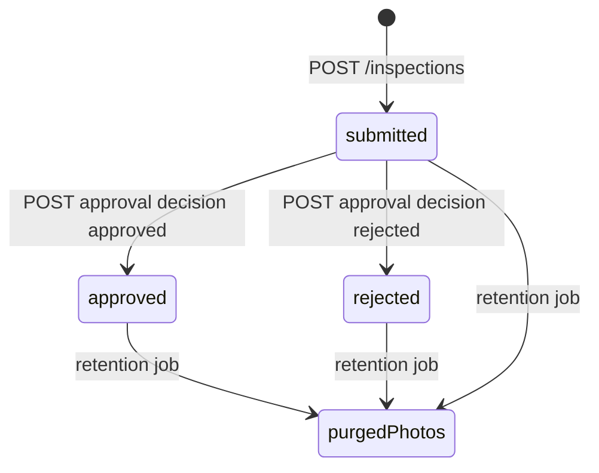

# Asset Inspection — Technical Design Document

Rebuild spec for the current application. A developer who has never opened this repo should be able to reimplement the product from this document plus the OpenAPI surface at `/docs`.

This is a **Technical Design Document**, not a test-driven-development guide. It describes **what the system must do**, not how every file is laid out today.

**Product version captured:** Asset Inspection (Indonesian: Inspeksi Aset). PDF links follow the live domain; localhost and the Android app use `REACT_APP_PUBLIC_URL`. README **1.12.0** (23 Sep 2026, 12:12 WIB).

---

## 1. Product and constraints

### 1.1 What it is

Daily dump-truck chassis **pre-delivery / pre-operation inspection (PDI / P2H)** for site drivers and mechanics:

1. Walk around the unit against a checklist.
2. Mark each item OK or a defect code, with optional notes and photos.
3. Submit for **site admin** approval.
4. Admins recap units across a date range and export CSV.

Inspectors work on phones at the unit. Admins maintain company catalogs (items, vehicle types, inspection types) and site fleets.

### 1.2 Non-negotiable constraints

| Constraint | Rule |
|------------|------|
| Hosting | Self-hosted. No cloud object store. Photos live on **local disk** (`STORAGE_ROOT`). |
| Schema | **Additive, idempotent migrations only.** Never wipe Mongo collections to “migrate.” |
| Drafts | In-progress forms live in **browser `localStorage`**, not the API. Field photos/outbox use **IndexedDB**. |
| Languages | English and Indonesian (`en` / `id`). |
| Auth | JWT access tokens **12 hours** plus refresh tokens **30 days**, HS256. |
| Photo size | Client compresses to JPEG **≤ 500 KB**; server rejects anything larger. |
| Photo URLs | Files are fetched with `Authorization`. **Do not put the session token in the image URL.** |
| Company mixing | Inspection types, items, and vehicle categories belong to a **company**. A unit at company A cannot use a type from company B. |

### 1.3 Out of scope for a faithful rebuild

- LLM / cloud AI features.
- Multi-region object storage.
- Server-side GPS or EXIF parsing (stamps are burned in on the client).
- Real-time sync of drafts across devices.
- Play Store listing, iOS, admin offline mode.

---

## 2. Architecture



| Layer | Choice |
|-------|--------|
| SPA | React 19, CRA + Craco, React Router 7, Tailwind + Radix/shadcn, axios |
| Android | Capacitor wrapping the same SPA (`frontend/android/`, appId `id.co.iti.inspeksidt`) |
| API | FastAPI, Pydantic v2, Motor (async Mongo), PyJWT, bcrypt |
| Database | MongoDB 7, database name `dt_inspection` |
| Photos | Directory under `STORAGE_ROOT`, metadata in `files` |

**Process split**

- Browser talks only to `{REACT_APP_BACKEND_URL}/api`.
- API prefix `/api`. Root `GET /` returns `{ message, status }`.
- Compose (closest to production): frontend **8802**, API **8801**, Mongo unpublished on the compose network.
- Host development: frontend **3000**, API **8000**, Mongo **27017**.

`REACT_APP_BACKEND_URL` and `REACT_APP_PUBLIC_URL` are **baked at frontend build time**. Changing either requires a frontend rebuild. The Android APK cannot use `localhost` for the API host; bake a reachable hostname. CORS must allow the WebView origin `https://localhost`. `REACT_APP_PUBLIC_URL` is the PDF link host when `window.location` is localhost (Compose port 8802 or the WebView). A non-localhost page uses its own origin. Docker defaults the public URL to `https://inspection.inlinetechint.org`; another domain must override it.

---

## 3. Domain model

All business documents use a Mongo `ObjectId` `_id`, exposed to clients as string `id`.

### 3.1 Hierarchy

```
Company
  └── Site
        ├── Users (site_admin, driver, mechanic)
        └── Trucks (units)
Company (catalog, not site-scoped)
  ├── Vehicle categories
  ├── Inspection categories
  ├── Inspection items
  └── Inspection types
```

`company_admin` belongs to a company (no required site). `superadmin` has neither company nor site.

### 3.2 Collections and fields

#### `companies`

| Field | Type | Notes |
|-------|------|--------|
| name, code | string | Required |
| address | string? | |
| is_active | bool | default true |

#### `sites`

| Field | Type | Notes |
|-------|------|--------|
| company_id | string | Required |
| name, code | string | Required |
| location | string? | |
| is_active | bool | default true |

Cannot delete a company that still has sites. Cannot delete a site that still has trucks or users.

#### `users`

| Field | Type | Notes |
|-------|------|--------|
| email | string | Unique index |
| name | string | |
| role | enum | `superadmin` \| `company_admin` \| `site_admin` \| `driver` \| `mechanic` |
| password_hash | string | bcrypt; never returned in API |
| company_id, site_id | string? | See role rules below |
| is_active | bool | Inactive users cannot authenticate |
| created_at | datetime | |

Password minimum **6 characters** on create/update.

#### `dump_trucks` (API resource: trucks)

| Field | Type | Notes |
|-------|------|--------|
| company_id, site_id | string | Derived from the site on write |
| unit_vin_number | string | Required |
| hull_number | string | Display identifier (e.g. DT-001) |
| plate_number | string? | |
| vehicle_category_id | string | Required on create |
| is_active | bool | |

List/get responses are **enriched** with `brand`, `model`, `drivetrain_layout`, `vehicle_category_name`, `category_ids` from the linked vehicle category. Those fields are **not** stored on the truck.

#### `vehicle_categories`

| Field | Type | Notes |
|-------|------|--------|
| company_id | string | |
| name | string | Required |
| brand, model, drivetrain_layout | string? | |
| category_ids | string[] | Ordered inspection-category IDs (the unit’s checklist pool) |
| is_active | bool | |

`category_ids` is **not** accepted on generic POST/PUT. Assign via `PUT /vehicle-categories/{id}/inspection-categories`.

#### `inspection_categories`

| Field | Type | Notes |
|-------|------|--------|
| company_id | string | |
| name, description? | string | |
| item_ids | string[] | Ordered item IDs |
| is_active | bool | |

`item_ids` assigned via `PUT /categories/{id}/items`. An item **may belong to multiple categories** (many-to-many). Deleting a category that still has `item_ids` returns **400**.

#### `inspection_items`

| Field | Type | Notes |
|-------|------|--------|
| company_id | string | |
| name | string | |
| guidance | string? | Shown under the item on the form |
| status_options | string[] | Default `["OK","NOT_OK","KOROSI"]`. Allowed codes: `OK`, `NOT_OK`, `KOROSI`, `KURANG`, `LONGGAR` |
| is_active | bool | |

Deleting an item **pulls** its id from every category `item_ids` and every type `excluded_item_ids`.

#### `inspection_types`

| Field | Type | Notes |
|-------|------|--------|
| company_id | string | |
| name | string | |
| code | string? | e.g. P2H, PDI |
| description | string? | |
| excluded_item_ids | string[] | Subtract from the unit pool |
| is_active | bool | |

`excluded_item_ids` is **not** accepted on generic POST/PUT. Assign via `PUT /inspection-types/{id}/excluded-items`. Inactive types cannot be used on checklist or submit.

#### `inspections`

See §3.5. Collection `inspections`. Index: `(site_id, inspection_date)`.

#### Operational collections

| Collection | Purpose | Key fields |
|------------|---------|------------|
| `meta` | Schema version | `_id: "schema"`, `version`, `name`, `applied_at` |
| `login_attempts` | Brute-force lockout | `identifier` (`{ip}:{email}`), `count`, `last_attempt` |
| `files` | Upload metadata | `storage_path`, `original_filename`, `content_type`, `size`, `uploaded_by`, `is_deleted`, `created_at`, `deleted_at` |
| `cron_runs` | Purge job tracking | `_id` (run id), `job`, `status`, `queued_at`, `triggered_by`, summary fields |

### 3.3 Checklist composition (core invariant)

The live checklist is **not** stored as a template. It is computed:



1. Resolve the truck (must be in the caller’s site/company scope).
2. Resolve the inspection type: same `company_id` as the truck, `is_active: true`.
3. Load the truck’s vehicle category → ordered `category_ids`.
4. For each category (skip missing/inactive): take ordered `item_ids`, drop inactive items and IDs in `excluded_item_ids`.
5. **Omit the group** if no items remain after subtract.
6. Return `{ truck: enriched, groups: [{ category, items }] }`.

Worked example: vehicle category lists Chassis (29) + EV (8) = 37. Type excludes 2 Chassis IDs → 35 items, Chassis group still present. Type that excludes an entire category’s items → that group disappears.

Empty exclude list = full unit pool. Excluding an ID that is not on this unit is a no-op.

### 3.4 Status codes and defects

- Form defaults every returned item to **`OK`**.
- A **defect** is any `status != "OK"` (`NOT_OK`, `KOROSI`, `KURANG`, `LONGGAR`).
- Notes are allowed on OK and not-OK. Photos are optional on OK (and typically used on defects).
- Per-item `status_options` from the item master control which pills are shown.

### 3.5 Inspection document (submit snapshot)

Inspections are **immutable snapshots**. Later edits to items, hull numbers, or type names do not rewrite history.

| Field | Notes |
|-------|--------|
| company_id, site_id, truck_id | From the truck at submit |
| truck_hull_number, truck_vin_number | Copied from truck |
| inspection_type_id, inspection_type_name | Copied from type |
| driver_id, driver_name | **Always the authenticated user** (driver or mechanic; admins can also submit as themselves) |
| km_hm | Number |
| started_at, completed_at | ISO-8601 UTC |
| inspection_date | `YYYY-MM-DD` (client local date, else server UTC date) |
| results[] | See below |
| total_items | `len(results)` |
| defect_count, has_defect | Count of `status != "OK"` |
| status | `submitted` \| `approved` \| `rejected` — create always `submitted` |
| approved_by, approved_by_name, approved_at, admin_note | Set on approval |
| general_note | Optional free text |
| photos_purged_at, purged_photo_count | Set by retention job |

**`results[]` element**

```
item_id, item_name, category_name?,
status,           # e.g. OK, NOT_OK, KOROSI
note?,
photos: [str]     # storage paths from POST /uploads
```

POST **400** if any `item_id` is in the type’s `excluded_item_ids`, or if `results` is empty.

### 3.6 Inspection lifecycle



Purge clears `results[].photos` and marks `files` deleted. The inspection row remains.

---

## 4. Auth and RBAC

### 4.1 Token

- Algorithm HS256, secret `JWT_SECRET`.
- Access claims: `sub` (user id), `email`, `role`, `type: "access"`, `exp` (+12h UTC).
- Refresh claims: same plus `type: "refresh"`, `exp` (+30d UTC). Login and refresh rotate both tokens. Inactive or missing users cannot refresh (401).
- Access token sent as `Authorization: Bearer <token>` (cookie `access_token` also accepted).
- User must exist and `is_active != false`.

Client stores the access token in `localStorage` key **`dt_token`** and the refresh token in **`dt_refresh`**. Axios attaches the access token. On **401**, try `POST /auth/refresh` once, then retry the request. If refresh fails **and the device is online**, clear tokens and redirect to `/login`. An offline 401 must not wipe the outbox IndexedDB. Cached user JSON is in **`dt_user`** so `/auth/me` can fail offline after the first login.

### 4.2 Login lockout

Identifier `{client_ip}:{email}`. After **5** failed attempts, **429** for **15 minutes** from `last_attempt`. Success clears the record.

### 4.3 Scoping helpers

**`site_scope(user, site_id?)`** — trucks, inspections, dashboard, recap, checklist truck lookup:

| Role | Filter |
|------|--------|
| superadmin | `{}` or `{ site_id }` if query given |
| company_admin | `{ company_id }` or `{ company_id, site_id }` |
| site_admin, driver, mechanic | `{ site_id: user.site_id }` (query ignored) |

**`company_scope(user, company_id?)`** — catalog masters:

| Role | Filter |
|------|--------|
| superadmin | `{}` or `{ company_id }` |
| everyone else | `{ company_id: user.company_id }` |

### 4.4 User-write rules

- `site_admin` may only create/update **driver** and **mechanic**, forced to own site/company.
- `company_admin` may create **site_admin**, **driver**, **mechanic**; `site_id` required.
- `superadmin` may create any role; `company_admin` needs `company_id`; other non-super roles need `site_id`.
- Nobody can delete themselves.

### 4.5 RBAC matrix

Legend: **R** read, **C** create, **U** update, **D** delete, **—** none. All reads are scoped.

| Resource | superadmin | company_admin | site_admin | driver | mechanic |
|----------|------------|---------------|------------|--------|----------|
| Companies | CRUD | R own | R own | R own | R own |
| Sites | CRUD | CRU own company | R own site | R own | R own |
| Users | CRUD | CRUD (not company_admin+) | CRUD drivers/mechanics | — | — |
| Categories / items / types / vehicle categories | CRUD | CRUD | R | R | R |
| Assignment PUTs (items, excludes, vehicle cats) | U | U | — | — | — |
| Trucks | CRUD any site | CRUD own company | CRUD own site | R own site | R own site |
| Checklist + create inspection | yes | yes | yes | yes as self | yes as self |
| List/get inspections | R | R | R | own `driver_id` only | own only |
| Approve / reject | U | U | U | — | — |
| Dashboard | R | R | R | own stats | own stats |
| Recap / recap CSV | R (site_id required) | R (site optional = company-wide) | R own site | — | — |
| Upload / download files | yes | yes | yes | yes | yes |
| Manual photo purge | C | — | — | — | — |
| Cron photo purge | `WEBHOOK_CRON_SECRET` | — | — | — | — |

Nav hides `/inspections` from driver and mechanic (they use `/my-inspections`). A site admin sees both: `/inspections` for the site, and `/my-inspections` for their own submissions, drafts, and queue. Master pages stay hidden by role. Direct URL to `/inspections` is not extra-guarded on the client; the API still filters driver and mechanic by `driver_id`.

---

## 5. API contract

Base path: `/api`. Unless noted, JWT required.

### 5.1 Auth

| Method | Path | Notes |
|--------|------|--------|
| POST | `/auth/login` | `{ email, password }` → `{ access_token, refresh_token, token_type, user }` |
| POST | `/auth/refresh` | `{ refresh_token }` → new access + refresh. 401 if token type is not `refresh` or user inactive |
| GET | `/auth/me` | Adds `site_name`, `company_name` |
| POST | `/auth/logout` | `{ ok: true }` (stateless) |

### 5.2 Companies, sites, users, trucks

Standard REST `GET` list, `POST` create, `PUT /{id}`, `DELETE /{id}`.

- `GET /sites?company_id=` — `company_id` honored for superadmin only.
- `GET /users?site_id=`
- `GET /trucks?site_id=`
- Truck create requires `vehicle_category_id`; vehicle category must belong to the truck’s company.

### 5.3 Company catalog

Prefixes: `/categories`, `/items`, `/inspection-types`, `/vehicle-categories`.

Read: all roles. Write: `superadmin`, `company_admin`. Superadmin may pass `?company_id=`. Generic create/update **strips** `item_ids`, `category_ids`, `excluded_item_ids`.

**Assignment (company_admin+), body `{ ids: string[] }` (order preserved, invalid IDs dropped, same-company only):**

| Method | Path | Sets |
|--------|------|------|
| PUT | `/categories/{id}/items` | category `item_ids` |
| PUT | `/inspection-types/{id}/excluded-items` | type `excluded_item_ids` |
| PUT | `/vehicle-categories/{id}/inspection-categories` | vehicle category `category_ids` |

### 5.4 Inspections

| Method | Path | Notes |
|--------|------|--------|
| GET | `/inspections/checklist` | **Required query:** `truck_id`, `inspection_type_id`. 400 if type missing/inactive/wrong company. |
| GET | `/sync/field` | One snapshot: `{ generated_at, trucks, inspection_types, checklists: [{ truck_id, inspection_type_id, truck, groups }] }`. Same composition as `/inspections/checklist` (category items minus `excluded_item_ids`). Scoped like trucks. All roles. |
| POST | `/inspections` | See `InspectionCreate` below. 400 empty results or excluded item ids. |
| GET | `/inspections` | Filters: `site_id`, `truck_id`, `status`, `date_from`, `date_to`, `driver_id`, `inspection_type_id`, `skip` default 0, `limit` default 200 (max 500). JSON array (omits `results`). `X-Total-Count` is the filtered total (CORS-exposed). Field roles cannot override `driver_id`. |
| GET | `/inspections/export` | Same filters, CSV, max 10 000 rows. |
| GET | `/inspections/{id}` | Full document including results. |
| POST | `/inspections/{id}/approval` | `{ decision: "approved" \| "rejected", admin_note? }`. site_admin+. |

**POST `/inspections` body**

```
truck_id, inspection_type_id,
km_hm: number,
started_at: datetime,
inspection_date?: "YYYY-MM-DD",
general_note?: string,
results: [{ item_id, item_name, category_name?, status, note?, photos: string[] }]
```

CSV header for list export:

`Date, Unit, VIN, Inspection Type, Driver/Mechanic, KM/HM, Checked, Defects, Status, Approved by, Started, Completed`

### 5.5 Dashboard and recap

| Method | Path | Notes |
|--------|------|--------|
| GET | `/dashboard` | `{ trucks, today_inspections, today_defects, pending_approval, recent[8] }` |
| GET | `/recap` | **Required:** `date_from`, `date_to`. Max range **92 days**. Superadmin must pass `site_id`. |
| GET | `/recap/export` | `kind=matrix\|summary` plus the same dates. |

Matrix CSV header starts `Hull Number,VIN,<dates…>`. Summary CSV includes hull, VIN, brand, model, drivetrain.

### 5.6 Files and purge

| Method | Path | Notes |
|--------|------|--------|
| POST | `/uploads` | multipart `file`; `Content-Type` must start with `image/`; max **500 KB** after full read. Path `dt-inspection/uploads/{user_id}/{uuid}.{ext}`. |
| GET | `/files/{path}` | JWT; 404 if `files.is_deleted`. |
| POST | `/cron/purge-photos` | `Authorization: Bearer {WEBHOOK_CRON_SECRET}`. Async. Dedup via `X-Webhook-Id` or body `run_id`. |
| POST | `/maintenance/purge-photos` | superadmin, synchronous. |

Retention: `PHOTO_RETENTION_DAYS` (default **90**). For inspections with `completed_at` older than that: clear photo paths, set `photos_purged_at` / `purged_photo_count`, mark file docs deleted.

---

## 6. Frontend

### 6.1 Routes

| Path | Page | Who |
|------|------|-----|
| `/login` | Login | Public; redirect if already authed |
| `/` | Dashboard | All roles |
| `/inspections/new` | New inspection form | All roles |
| `/inspections/:id` | Detail + approval | All roles (API-scoped) |
| `/inspections` | Admin report list + CSV | Nav: site_admin+ |
| `/my-inspections` | Own submissions + local drafts + queued | Nav: site_admin, driver, mechanic. Site admin list is filtered with `driver_id` of the signed-in user so it does not duplicate `/inspections`. |
| `/companies` | Companies CRUD | superadmin |
| `/sites` | Sites | company_admin+ |
| `/vehicle-categories`, `/categories`, `/items`, `/inspection-types` | Catalog | company_admin+ |
| `/users`, `/trucks`, `/recap` | Users, units, recap | site_admin+ |

Shell: sidebar filtered by role, language toggle, logout.

### 6.2 Master data UX

Generic CRUD table (`MasterPage`) plus **AssignDialog**: two columns (assigned / available), reorder up/down, save `{ ids }`.

| Screen | Assignment |
|--------|------------|
| Vehicle categories | Inspection categories → unit checklist pool |
| Inspection categories | Items (many-to-many, ordered) |
| Inspection types | **Excluded** items (labels: excluded / available) |

### 6.3 New inspection form

Must not load a checklist until **both** unit and inspection type are chosen. Placeholder until then.

**Scope change (site, unit, or type)** while `answersDirty()`: confirm dialog, then discard statuses, notes, photos, and general note. **KM/HM is kept.** Truck/type change then reloads checklist.

`answersDirty` = general note non-empty **or** any result with non-OK status, note, or photos. Selecting unit/type/km alone is not dirty.

**Submit enabled when:** truck + type + km/hm + every item has a status.

**POST body** matches §5.4. On success: delete the local draft and navigate to `/inspections/{id}`.

**On-device drafts**

- Key: `dt_inspection_drafts_{userId}`
- Shape: `{ id, site_id, truck_id, type_id, km_hm, general_note, started_at, results, saved_at }`
- `results[].photos` may be server paths **or** `{ localId }` (IndexedDB JPEG) until sync.
- Autosave ~1.5s when the form has data; manual “Save progress”; leave-route blocker (save / discard / stay).
- Resume via `?draft={id}`. Shown on **Inspeksi Saya** for site admin, driver, and mechanic.
- Offline submit (site admin, driver, mechanic): validate against the cached checklist, enqueue the outbox, treat as success from the user’s point of view (**Queued**). Online submit: upload any local blobs then `POST /inspections`. Company admin and superadmin cannot enqueue.

### 6.4 Camera and photo stamp

In-app overlay (not the OS camera, unless fallback):

1. `getUserMedia({ video: { facingMode: { ideal: "environment" }, width: { ideal: 1280 } }, audio: false })`.
2. If `track.getCapabilities().torch` is true, show a Zap toggle on the **live preview only** (not the retake screen). Default **off**. `applyConstraints({ advanced: [{ torch }] })`. Keep torch on across retakes until the overlay closes. On apply failure: turn off and toast flash unavailable. Hide the control on desktop / many iOS builds / file-picker fallback.
3. Stop tracks (torch off first) when the overlay unmounts. Keep the `<video>` mounted (hidden) during review so retake still has a stream.
4. Compress JPEG: max dimension 1280, quality loop, **≤ 500 KB**.
5. **Stamp burned into the pixels** before upload: datetime, lat/lon or “GPS unavailable”, up to two reverse-geocode lines (BigDataCloud, ~50 m cache), altitude + inspector name, compass rose. GPS/heading are **client-only**.
6. If `getUserMedia` fails: file input `accept="image/*" capture="environment"` — no flash promise.
7. On the **website while online**, `POST /uploads` immediately and store the returned path. On **native** (and on the web while offline), write the JPEG to IndexedDB and keep `{ localId }` until outbox sync.
8. Native capture uses Capacitor `Camera.getPhoto`, then the same stamp + ≤ 500 KB compress. The OS camera UI replaces the in-app torch preview. Location comes from `@capacitor/geolocation` (permission prompt, then a coarse retry). The stamp waits for a fix before it is burned in. On a website served over plain HTTP, the browser will not provide GPS.

### 6.4.1 Inspection PDF

From the detail page, **Export PDF** builds an A4 file in the browser (`jspdf`). It includes the header, notes, defect rows, and the full checklist. There is no category column. Photos are drawn in the item row. A link (and each photo) opens `/inspections/{id}`. When the page host is a public domain, that host is used. When it is localhost — local Docker on port 8802, or the Android WebView — the link uses `REACT_APP_PUBLIC_URL` (Docker default `https://inspection.inlinetechint.org`), or the public API origin if that variable is unset. A local `yarn start` with a localhost API still links to localhost. The existing click-to-open photo viewer is on that page. If the viewer is signed out, login returns to that inspection. On the website the file downloads through the browser. Inside the Android WebView the same button writes the PDF to the app cache (`@capacitor/filesystem`) and opens the system share sheet (`@capacitor/share`). Dismissing that sheet is not an error.

### 6.5 i18n

Custom dict in `frontend/src/lib/i18n.js`, not i18next. `localStorage.dt_lang` (`en` default). `t(key)` falls back to English then the key.

### 6.6 Field offline (Capacitor)

Company admin and superadmin keep using the website online. Driver, mechanic, and site admin can install the APK. **First login and first snapshot pull require a network.** After that, walk-around, photos, and save work without signal. A site admin’s snapshot is the same site scope as a driver’s.

| Store | Contents |
|-------|----------|
| Snapshot | Last `GET /sync/field` |
| Photo blobs | JPEG bytes keyed by `localId` |
| Outbox | `{ draftId, payload, photoLocalIds, status, error }` |

Form reads trucks/types/checklist from the snapshot when offline. Missing combo: tell the user to sync while online.

Sync (serial, resume-safe): refresh access token → pull snapshot → for each outbox item upload photos, rewrite `results[].photos` to server paths, `POST /inspections`, drop outbox + blobs. On `400` excluded-item: refresh snapshot, strip excluded ids if the remainder still covers the current checklist, retry once; otherwise mark that item failed. Company admin and superadmin skip the outbox. Backend `FIELD_ROLES` stays `driver` and `mechanic` so a site admin’s report list, detail, and dashboard still cover the whole site.

Header **Sync** control: last synced, pending count, errors. Inspeksi Saya shows **Queued** as a client-only status (not a Mongo status). CSV export stays server-side rows only.

Build: `cd frontend && yarn cap:sync`, then Android Studio **Build APK**. Debug live-reload: temporarily set `server.url` in `capacitor.config.ts` to the LAN CRA URL (`cleartext: true`).

### 6.7 Auth images

Inspection photos render through an authenticated blob fetch (`AuthImage` / `fetchFileObjectUrl`), never a naked `` with a token query param.

---

## 7. Seed, migrations, tests, deploy

### 7.1 Seed (idempotent on API startup)

| Entity | Seeded |
|--------|--------|
| Company | PT Inline Technology International (`ITI`) |
| Sites | IMIP Morowali, IWIP Weda Bay |
| Users | Superadmin from env; `company.admin@iti.demo` / Admin@1234; `admin@iti.demo` site_admin; `driver@iti.demo`, `driver2@iti.demo`; `mechanic@iti.demo` / Driver@1234 |
| Categories | Chassis Inspection (~29–32 walk-around items), EV Components (8) |
| Types | Daily (P2H), Weekly, Pre-Delivery (PDI) — empty excludes |
| Vehicle categories | BYD Q3 EV 6x4, Hino FM 260 JD, Mitsubishi Fuso FJ 2528 |
| Trucks | DT-001…DT-005 at IMIP |
| Sample inspections | If IMIP has none, ~7 days of history for the first four units |

Demo passwords are local-only.

### 7.2 Migrations

`LATEST_SCHEMA_VERSION = 5`. Recorded on `meta`. Pending steps run on startup after seed.

| Version | Name | Effect |
|---------|------|--------|
| 2 | assignment-fields | hull/VIN/category_ids; item `guidance`; backfill category `item_ids` |
| 3 | backfill-inspection-types | Stamp P2H type onto inspections missing type |
| 4 | company-catalog-vehicle-categories | `admin`→`site_admin`; lift catalog to company; split vehicle categories off trucks |
| 5 | excluded-item-ids | Ensure every type has `excluded_item_ids: []` |

New schema work must be `migrate_00N` — never a collection drop.

### 7.3 Tests

| Suite | When |
|-------|------|
| `backend/tests/test_migrations.py` | No running server |
| `backend/tests/backend_test.py` | Live API at `REACT_APP_BACKEND_URL` (default `http://localhost:8001`), pytest-xdist `-n 2` |

Live suite covers auth (including refresh + inactive user), RBAC, truck/VIN, checklist sizes (EV 37 / ICE 29 when type has no excludes), type excludes, `GET /sync/field` matching checklist composition, inspection create/approve, recap CSV headers, upload 500 KB limit, purge.

### 7.4 Environment

```
MONGO_URL, DB_NAME=dt_inspection
JWT_SECRET
SUPERADMIN_EMAIL, SUPERADMIN_PASSWORD
CORS_ORIGINS
WEBHOOK_CRON_SECRET, PHOTO_RETENTION_DAYS=90
STORAGE_ROOT
REACT_APP_BACKEND_URL
REACT_APP_PUBLIC_URL   # PDF links from localhost / Android; default https://inspection.inlinetechint.org
```

---

## 8. Rebuild sequence

Implement in this order so each phase is demoable and testable.

1. **Identity** — JWT login/me/refresh, lockout, companies / sites / users, `site_scope` / `company_scope`, seed superadmin.
2. **Company catalog** — items, inspection categories, types, vehicle categories; assignment PUTs; item-delete `$pull`.
3. **Fleet + checklist** — trucks with `vehicle_category_id`; `GET /checklist` composition + excludes; POST inspection 400 on excluded ids; `GET /sync/field`.
4. **Form + camera** — wait for unit+type; dirty confirm; localStorage drafts; camera/torch/stamp/500 KB; `POST /uploads` + `GET /files` with Authorization.
5. **Field offline** — IndexedDB snapshot/photos/outbox; Capacitor Android shell; refresh interceptor; Queued on Inspeksi Saya.
6. **Workflow** — list/detail/export filters; approval; field-user isolation; dashboard KPIs.
7. **Ops** — recap matrix/summary + 92-day cap; photo retention cron + superadmin purge; EN/ID; Docker Compose.

Parity checklist for a rebuild: EV unit + empty-exclude type = 37 items; same unit + type excluding 2 chassis ids = 35; type that only excludes items from an unassigned category = still 37; field user cannot list another inspector’s inspections; desktop camera hides flash; overlay close stops the media tracks.
