# Panduan Pengguna — Inspeksi Aset

**Inline Technology International**  
Versi aplikasi: **1.10.0**  
Tanggal dokumen: 22 September 2026

---

## Cara memakai dokumen ini

1. Buka aplikasi **Inspeksi Aset**.
2. Di pojok kanan atas, pilih **ID** (bukan EN) agar label di layar sama dengan panduan ini.
3. Nama tombol, menu, dan kolom di dokumen ini dikutip **persis** dari antarmuka.

Jika bahasa layar masih Inggris, klik **ID** pada sakelar **EN / ID**. Pilihan bahasa tersimpan di peramban.

---

## 1. Tentang aplikasi

**Inspeksi Aset** adalah aplikasi inspeksi harian chassis dump truck untuk driver dan mekanik di site. Dengan aplikasi ini Anda dapat:

- mengisi checklist walk-around (keliling unit);
- merekam foto temuan (dengan cap GPS, waktu, dan nama pemeriksa);
- menyimpan **draf di perangkat** lalu mengirim inspeksi;
- meminta persetujuan admin site;
- melihat laporan dan rekap kendaraan per site.

Setelah **Kirim Inspeksi**, data di server tidak dapat diubah. Dari halaman detail, **Ekspor PDF** mengunduh laporan inspeksi itu (header, checklist, dan foto). Tidak ada pemulihan kata sandi mandiri. Draf hanya tersimpan di peramban perangkat itu (bukan di server).

---

## 2. Peran dan menu

Hak akses mengikuti peran akun. **Mekanik** memiliki hak yang sama dengan **Driver**.

| Peran | Menu yang terlihat | Tidak dapat |
| --- | --- | --- |
| **Superadmin** | Semua menu, termasuk **Perusahaan** | — |
| **Admin Perusahaan** | Beranda, Site, Pengguna & Peran, Kategori Kendaraan/Aset, Daftar Kendaraan/Aset, Kategori Inspeksi, Item Inspeksi, Tipe Inspeksi, Inspeksi Baru, Laporan Inspeksi, Rekap Kendaraan Site | Perusahaan |
| **Admin Site** | Beranda, Pengguna & Peran, Daftar Kendaraan/Aset, Inspeksi Baru, Laporan Inspeksi, Rekap Kendaraan Site | Perusahaan, Site, master checklist (kategori/item/tipe inspeksi, kategori kendaraan) |
| **Driver** | Beranda, Inspeksi Baru, **Inspeksi Saya** | Data Master, Rekap, persetujuan |
| **Mekanik** | Sama dengan Driver | Sama dengan Driver |

Kelompok menu di sidebar:

- **Beranda**
- **Data Master** — sesuai peran
- **Transaksi** — Inspeksi Baru; **Laporan Inspeksi** (admin) atau **Inspeksi Saya** (driver/mekanik)
- **Laporan** — Rekap Kendaraan Site (admin)

Di bagian bawah sidebar: nama pengguna, lencana peran, nama site (jika ada), dan tombol **Keluar**.

---

## 3. Masuk dan keluar

### 3.1 Masuk

1. Buka halaman **Masuk ke akun Anda**.
2. Isi **Email** dan **Kata sandi**.
3. Klik **Masuk**.

Jika gagal, muncul pesan **Gagal masuk**. Setelah **5 percobaan gagal**, akun dikunci **15 menit**. Sesi berlaku **12 jam**. Akun **Nonaktif** tidak dapat masuk.

Tidak ada tautan lupa kata sandi. Perubahan kata sandi dilakukan admin di **Pengguna & Peran** (field **Kata sandi**; kosongkan untuk mempertahankan kata sandi saat ini). Minimum 6 karakter.

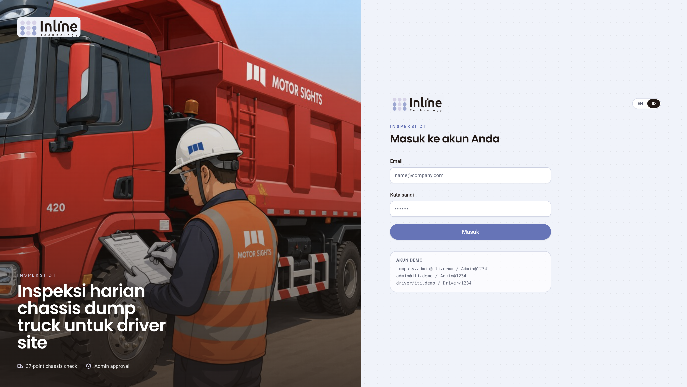

*Gambar 1. Halaman masuk. Pilih **ID** di sakelar bahasa sebelum mulai bekerja.*

### 3.2 Keluar

Klik **Keluar** di sidebar. Anda kembali ke halaman masuk.

---

## 4. SOP Driver dan Mekanik

Driver dan mekanik hanya melihat inspeksi yang mereka kirim sendiri. Nama pelaksana terisi otomatis (akun yang sedang masuk); tidak ada dropdown pilih orang lain.

### 4.1 Beranda

Setelah masuk, halaman **Beranda** menampilkan **Selamat datang** plus nama Anda, tombol **Mulai inspeksi**, dan kartu:

- **Kendaraan/Aset Aktif**
- **Inspeksi Hari Ini**
- **Temuan Hari Ini**
- **Menunggu Persetujuan**

Di bawahnya: **Inspeksi Terbaru** dan tautan **Lihat semua**. Jika kosong: **Belum ada data**.

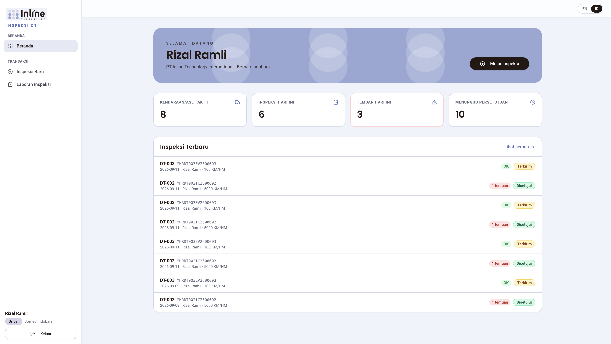

*Gambar 2. Beranda setelah masuk sebagai Driver.*

### 4.2 Mulai inspeksi

Buka **Inspeksi Baru** dari menu **Transaksi**, atau klik **Mulai inspeksi** di Beranda.

Subjudul di layar: *Kelilingi unit berlawanan arah jarum jam dan periksa setiap item.*

Isi formulir atas:

| Kolom | Keterangan |
| --- | --- |
| **Daftar Kendaraan/Aset** | Wajib. Pilih unit aktif di site Anda. |
| **Tipe Inspeksi** | Wajib. Contoh seed: Daily Inspection (P2H), Weekly Inspection, Pre-Delivery Inspection (PDI). |
| **KM / HM saat inspeksi** | Wajib. |
| **Mulai**, **Driver/Mekanik**, **VIN**, **Konfigurasi Penggerak** | Terisi otomatis. |

Jika unit belum punya kategori inspeksi: *Unit ini belum memiliki kategori inspeksi. Minta admin memasang kategori.*

Checklist **belum dimuat** sampai **Daftar Kendaraan/Aset** dan **Tipe Inspeksi** keduanya terisi. Placeholder: *Pilih kendaraan/aset dan tipe inspeksi untuk memuat checklist.*

Jika Anda sudah mengisi status, catatan, atau foto lalu mengubah **Site**, kendaraan, atau tipe: dialog **Buang jawaban saat ini?** — *Mengubah site, kendaraan, atau tipe inspeksi akan membuang status item, catatan, foto, dan catatan umum. KM/HM tetap disimpan.* Pilih **Batal** atau **Buang jawaban**.

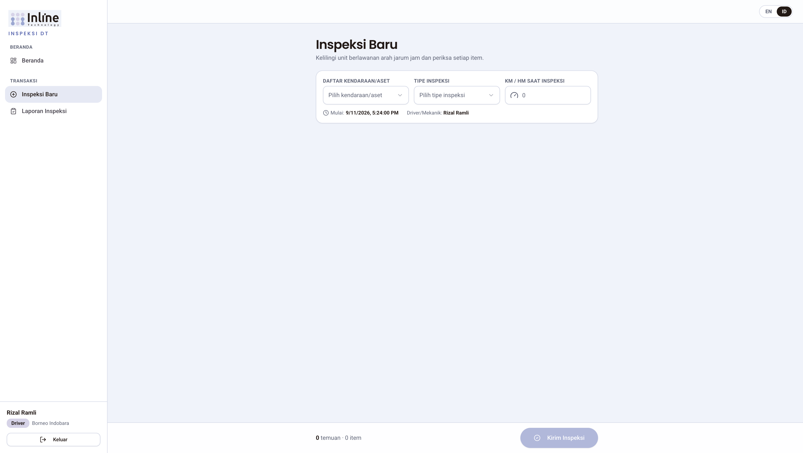

*Gambar 3. Pilih kendaraan/aset, tipe inspeksi, dan isi KM/HM.*

### 4.3 Checklist walk-around

Checklist disusun dari **Kategori Kendaraan/Aset** unit → kategori inspeksi terpasang (urutan berlawanan arah jarum jam) → item terpasang, **dikurangi** item yang dikecualikan pada **Tipe Inspeksi** yang dipilih. Jika admin tidak mengecualikan apa pun, checklist sama dengan seluruh kumpulan item unit.

Petunjuk di layar: *Semua item dimulai sebagai OK — ubah status hanya jika menemukan masalah.*

Progres: `{n}/{total} item ditandai`.

Untuk setiap item:

1. Baca nama item dan **Panduan Teknis**.
2. Biarkan **OK** jika tidak ada masalah.
3. Jika ada masalah, pilih status yang tersedia untuk item itu: **Not OK**, **Korosi**, **Kurang**, atau **Longgar** (tergantung **Pilihan Status** item).
4. **Catatan temuan** (*Jelaskan temuan...*) boleh diisi pada OK maupun temuan.
5. Foto bersifat **Foto (opsional)** untuk semua status.

Cara mengambil foto:

1. Klik **Ambil foto** (kamera belakang jika tersedia).
2. Jika perangkat mendukung lampu terus-menerus, tombol **Lampu kilat** muncul di samping **Jepret**. Ketuk untuk nyala/mati. Tombol disembunyikan jika kamera tidak mendukung (banyak komputer meja dan sebagian iOS). Default **mati**.
3. **Jepret**.
4. **Ulangi** atau **Gunakan foto**.
5. Tunggu **Memproses...** (kompresi, maksimum 500 KB). Cap tanggal/waktu, GPS atau *GPS tidak tersedia*, lokasi, dan nama pemeriksa tertanam di foto.

Jika kamera ditolak: *Kamera tidak tersedia. Izinkan akses kamera.* Unggah berkas gambar. Hanya format gambar yang diterima. Lampu kilat **tidak** tersedia pada unggah berkas.

Opsional di akhir: **Catatan umum** — *Ada hal lain yang perlu dilaporkan?*

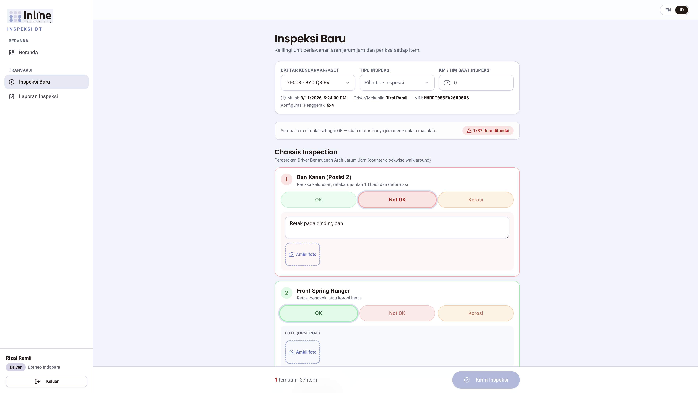

*Gambar 4. Semua item mulai sebagai OK. Catatan dan foto opsional pada setiap item; ubah status hanya pada temuan.*

### 4.4 Simpan draf di perangkat

Tombol **Simpan progres** menyimpan ke perangkat ini (*Progres disimpan di perangkat ini*). Draf juga ditawarkan saat meninggalkan halaman: **Simpan inspeksi ini?** — *Anda memiliki inspeksi yang sedang diisi. Simpan draf di perangkat ini, atau buang.* Pilih **Simpan draf**, **Buang draf**, atau batal.

Daftar draf muncul di **Inspeksi Baru** (*Draf di perangkat ini*) dan di **Inspeksi Saya**. **Lanjutkan** membuka draf; **Hapus draf** menghapusnya dari perangkat. Draf **tidak** ikut jika Anda ganti peramban, hapus data situs, atau pindah ke ponsel lain.

### 4.5 Kirim

Klik **Kirim Inspeksi**. Saat proses: **Mengirim...**

Syarat: kendaraan/aset, tipe inspeksi, KM/HM, dan semua item sudah diperiksa. Jika kurang: *Pilih kendaraan/aset, tipe inspeksi, isi KM/HM, dan periksa semua item.*

Setelah berhasil: *Inspeksi berhasil dikirim.* Status menjadi **Terkirim**. Draf terkait di perangkat dihapus.

**Tidak dapat** mengedit inspeksi yang sudah dikirim. Perbaiki kesalahan dengan inspeksi baru atau hubungi admin.

### 4.6 Melihat inspeksi sendiri

Menu **Inspeksi Saya** menampilkan kiriman Anda di server plus draf di perangkat. Filter kiriman: **Unit**, **Tipe Inspeksi**, **Waktu inspeksi** (Dari — Sampai), **Status** (**Semua** / **Terkirim** / **Disetujui** / **Ditolak**).

Kolom: Tanggal, Unit, Tipe Inspeksi, Driver/Mekanik, KM/HM, **Diperiksa**, temuan, Status, Disetujui oleh, **Lihat**.

Klik **Lihat** untuk **Detail Inspeksi**: KM/HM, tipe, driver/mekanik, mulai, selesai, durasi (**mnt**), admin penyetuju, persetujuan, tabel **Item temuan** dan **Semua item**.

Driver/mekanik **tidak** melihat tombol **Setujui** / **Tolak**.

---

## 5. SOP Admin Site

Admin site mengelola site miliknya: pengguna Driver/Mekanik, daftar kendaraan, persetujuan inspeksi, dan rekap.

### 5.1 Pengguna & Peran

Buka **Pengguna & Peran**. Admin site hanya membuat **Driver** dan **Mekanik** untuk site-nya. Petunjuk di layar: *Admin site hanya dapat membuat akun Driver dan Mekanik untuk site-nya.* Saat ubah, field **Peran** tidak dapat diganti.

Kolom form: **Nama**, **Email**, **Peran**, **Site** (otomatis), **Kata sandi**, **Aktif**.

Tombol: **Tambah**, **Ubah**, **Hapus**, **Cari...**, **Simpan**, **Batal**. Hapus: *Hapus data ini?* — *Tindakan ini tidak dapat dibatalkan.*

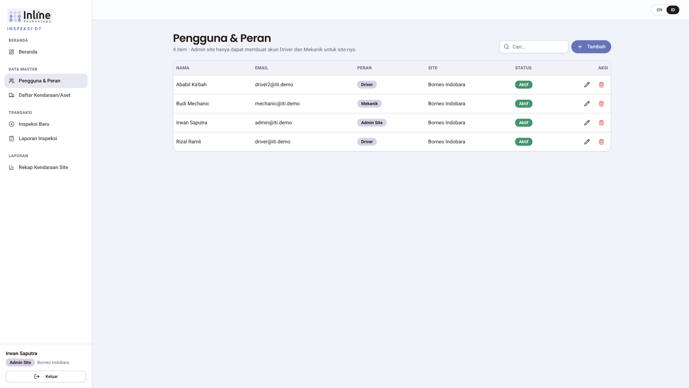

*Gambar 5. Admin site mengelola akun Driver dan Mekanik.*

### 5.2 Daftar Kendaraan/Aset

Buka **Daftar Kendaraan/Aset**. Site mengikuti akun login (tidak ada pemilih Site).

| Kolom | Wajib |
| --- | --- |
| **Nomor VIN Unit** | Ya |
| **Nomor Lambung** | Ya |
| **Nomor Polisi** | Tidak |
| **Kategori Kendaraan/Aset** | Ya — menentukan checklist |
| **Aktif** | — |

Merek dan model tampil dari kategori kendaraan.

### 5.3 Menyetujui atau menolak inspeksi

1. Buka **Laporan Inspeksi**.
2. Filter **Status** = **Terkirim** (atau **Menunggu** di kartu beranda).
3. Klik **Lihat**.
4. Pada kartu persetujuan: isi **Catatan admin** (opsional) lalu **Setujui** atau **Tolak**.

Hanya inspeksi berstatus **Terkirim** yang dapat diproses. Setelah **Disetujui** atau **Ditolak**, kartu persetujuan tidak muncul lagi.

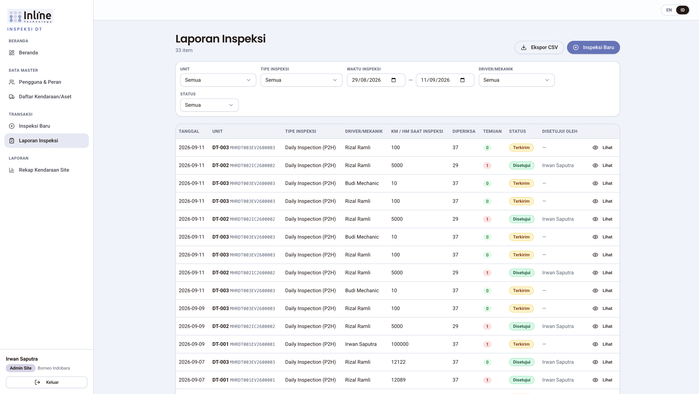

*Gambar 6. Filter dan daftar laporan inspeksi.*

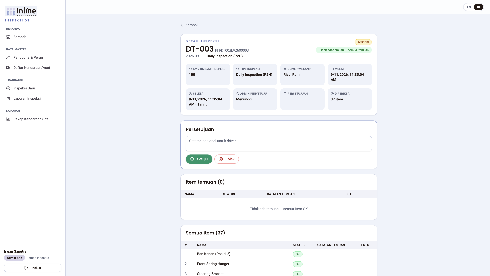

*Gambar 7. Detail inspeksi dengan tombol Setujui dan Tolak.*

### 5.4 Rekap Kendaraan Site

Menu **Rekap Kendaraan Site** — *Matriks Harian · Ringkasan*.

- Rentang tanggal maksimum **92 hari**.
- **Matriks Harian:** kisi unit × tanggal. Hijau = **Diinspeksi, semua OK**; merah = **Ada temuan**; abu = **Belum diinspeksi**. Klik sel untuk membuka detail. **Ekspor CSV Matriks**.
- **Ringkasan:** agregat per unit (Nomor Lambung, VIN, Merek, Model, Konfigurasi Penggerak, Total Inspeksi, Hari Diinspeksi, Temuan, Ada Temuan, Disetujui, Menunggu, Inspeksi Terakhir, KM/HM Terakhir). **Ekspor CSV Ringkasan**.

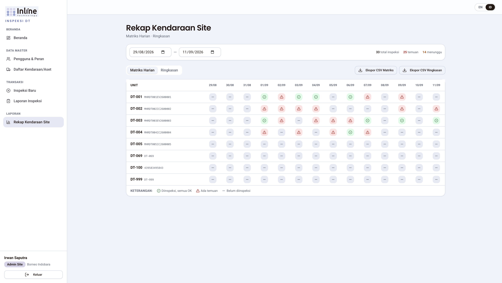

*Gambar 8. Matriks harian rekap kendaraan site.*

**Ekspor CSV** juga tersedia di Laporan Inspeksi (mengikuti filter aktif).

---

## 6. SOP Admin Perusahaan

Admin perusahaan mengelola master data perusahaan (bukan menu Perusahaan) dan semua site di perusahaannya.

### 6.1 Site

**Site:** **Nama**, **Kode**, **Lokasi**, **Aktif**. Perusahaan terisi otomatis. Hapus ditolak jika masih ada kendaraan atau pengguna.

### 6.2 Item, kategori, dan tipe inspeksi

Urutan kerja yang disarankan:

1. **Item Inspeksi** — **Nama**, **Panduan Teknis**, **Pilihan Status** (OK, Not OK, Korosi, Kurang, Longgar), **Aktif**.
2. **Kategori Inspeksi** — **Nama**, **Deskripsi**. Klik **Atur item** untuk **Item Terpasang** (urutan walk-around). Panel **Terpasang (berurutan)** vs **Tersedia**; **Pasang**, **Lepas**, **Naik**, **Turun**. Satu item boleh ada di beberapa kategori.
3. **Tipe Inspeksi** — **Nama**, **Kode**, **Deskripsi**, **Aktif**. Dipilih saat mulai inspeksi.
4. **Kecualikan item** pada baris tipe membuka daftar **Dikecualikan** vs **Tersedia**. Subtitle: *Item yang dikecualikan dihilangkan dari checklist tipe ini. Kategori kendaraan tetap menentukan kumpulan item.* Kolom **Item dikecualikan** menampilkan jumlah. Daftar kosong = checklist penuh sesuai kategori kendaraan. Kategori yang seluruh itemnya dikecualikan tidak muncul di form.

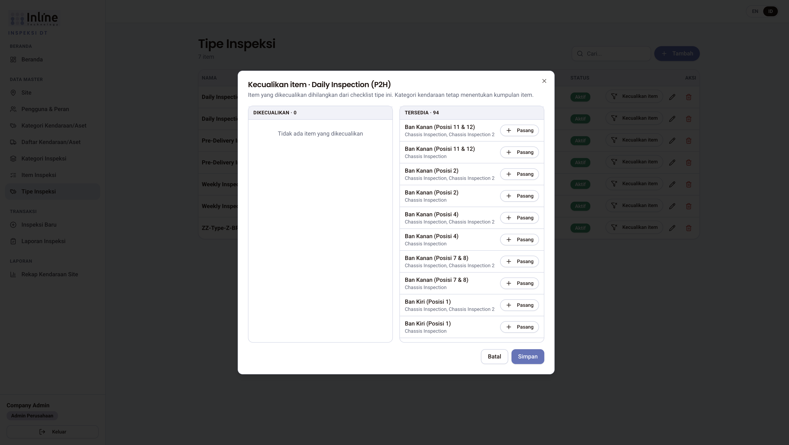

*Gambar 9. Dialog Kecualikan item: pindahkan item ke Dikecualikan, lalu Simpan.*

### 6.3 Kategori Kendaraan/Aset

Template merek/model/layout per perusahaan:

- **Nama**, **Merek**, **Model**, **Konfigurasi Penggerak** (4x2, 4x4, 6x2, 6x4, 6x6, 8x4, 8x8), **Aktif**.
- **Atur kategori** membuka **Kategori Terpasang**. Subtitle: *Urutan pergerakan berlawanan arah jarum jam.*

Checklist unit = gabungan item dari semua kategori inspeksi yang dipasang ke kategori kendaraan itu, **dikurangi** item yang dikecualikan pada tipe inspeksi. Contoh: kategori **EV Components** hanya dipasang ke unit EV.

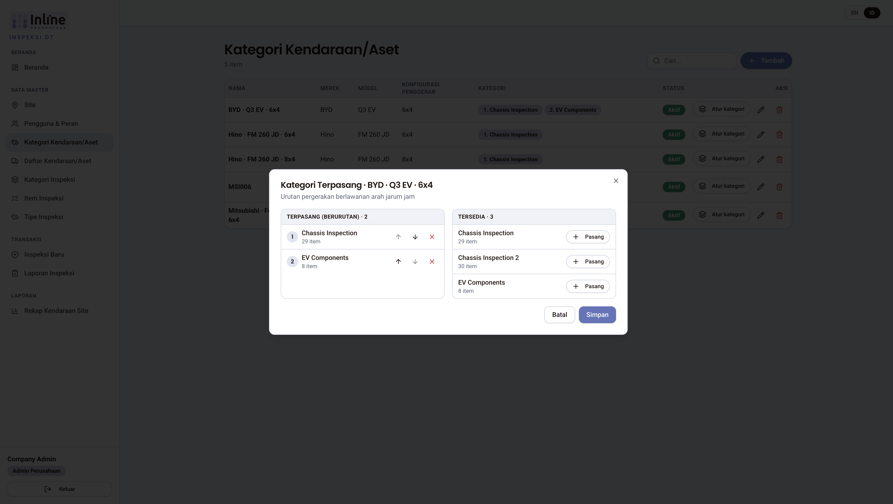

*Gambar 10. Pasang kategori inspeksi ke kategori kendaraan/aset.*

### 6.4 Daftar kendaraan — wajib pilih Site

Admin perusahaan (dan superadmin) melihat pemilih **Site** di header daftar **dan** di form tambah/ubah. **Site** wajib. Unit milik satu site.

Kolom sama seperti admin site, plus **Site**.

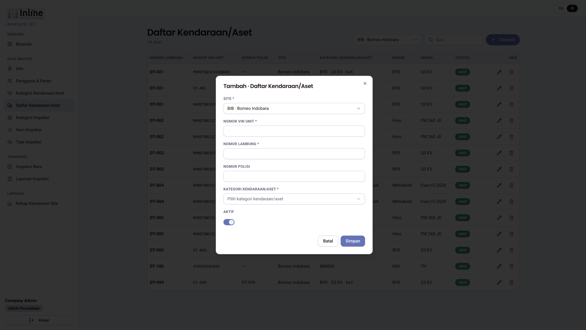

*Gambar 11. Admin perusahaan wajib memilih Site saat menambah kendaraan/aset.*

### 6.5 Pengguna

Admin perusahaan dapat membuat **Admin Site**, **Driver**, dan **Mekanik** (bukan Superadmin atau Admin Perusahaan lain). Pilih **Perusahaan** dan **Site** sesuai kebutuhan.

### 6.6 Inspeksi dan rekap

Sama seperti admin site, dengan pemilih **Site** di Laporan Inspeksi dan Rekap untuk berpindah site di dalam perusahaan. Filter **Driver/Mekanik** tersedia untuk admin. Dashboard menampilkan statistik seluruh site perusahaan.

---

## 7. SOP Superadmin

Superadmin memiliki semua menu Admin Perusahaan, plus **Perusahaan**.

**Perusahaan:** **Nama**, **Kode**, **Alamat**, **Aktif**. Hapus ditolak jika masih ada site.

Di banyak halaman master, pilih **Perusahaan** (dan kadang **Site**) di header sebelum menambah data. Superadmin dapat membuat kelima peran. **Admin Perusahaan** tidak terikat site. Rekap mewajibkan pemilihan site.

---

## 8. Laporan, status, dan ekspor

| Status | Arti |
| --- | --- |
| **Terkirim** | Baru dikirim; menunggu admin |
| **Disetujui** | Admin menyetujui |
| **Ditolak** | Admin menolak |
| **Menunggu** | Masih menunggu persetujuan (kartu beranda) |

Hanya admin (site, perusahaan, superadmin) yang menyetujui. Ekspor daftar: **Ekspor CSV**, **Ekspor CSV Matriks**, **Ekspor CSV Ringkasan**. Di detail inspeksi, **Ekspor PDF** mengunduh laporan satu inspeksi: header, checklist tanpa kolom kategori, dan foto pada baris item. Tautan di PDF membuka kembali detail inspeksi itu, tempat foto dapat dibuka seperti di aplikasi.

Jika ada beberapa inspeksi pada unit yang sama di hari yang sama, sel matriks mengikuti inspeksi terakhir hari itu; sel merah jika ada temuan.

---

## 9. Foto

- Foto **opsional** untuk setiap item (termasuk OK).
- Maksimum **500 KB** setelah kompresi di perangkat.
- Cap tertanam: tanggal/waktu, koordinat atau *GPS tidak tersedia*, nama tempat (jika GPS ada), ketinggian, nama pemeriksa, kompas.
- **Lampu kilat** hanya pada pratinjau kamera langsung jika perangkat mendukung lampu terus-menerus (bukan flash sekali jepret).
- Disimpan di server aplikasi; tampil di detail (klik untuk memperbesar).
- Masa simpan default **90 hari**. Setelah dibersihkan: *Foto telah dihapus setelah masa simpan 3 bulan; data inspeksi tetap tersimpan.*

---

## 10. Hierarki data

Checklist tidak disusun per unit satu per satu. Alurnya:

```
Perusahaan
  ├─ Item Inspeksi
  ├─ Kategori Inspeksi  ── memasang item (banyak-ke-banyak, berurutan)
  ├─ Tipe Inspeksi  ── mengecualikan item dari kumpulan unit
  ├─ Kategori Kendaraan/Aset  ── memasang kategori inspeksi (berurutan)
  └─ Site
       └─ Unit (Daftar Kendaraan/Aset)  ── satu kategori kendaraan
            └─ Checklist = item kategori kendaraan − item dikecualikan tipe
```

Unit aktif tanpa kategori terpasang tidak dapat diinspeksi sampai admin memasang kategori.

---

## 11. Pertanyaan umum

**Checklist tidak muncul.**  
Pilih unit **dan** tipe inspeksi. Jika tetap kosong: minta Admin Perusahaan memasang **Kategori Inspeksi** ke **Kategori Kendaraan/Aset**, atau periksa **Kecualikan item** pada tipe itu.

**Draf hilang.**  
Draf hanya di perangkat/peramban yang sama. Menghapus data situs atau ganti HP menghapus draf.

**Tidak bisa masuk.**  
Periksa email/kata sandi, status **Aktif**, dan apakah akun terkunci 15 menit setelah 5 gagal. Tidak ada lupa kata sandi — hubungi admin.

**Tidak ada tombol Setujui.**  
Hanya admin, dan hanya jika status **Terkirim**. Driver/mekanik tidak menyetujui.

**Tidak ada tombol Lampu kilat.**  
Kamera perangkat tidak melaporkan lampu terus-menerus. Itu normal di banyak komputer. Unggah berkas juga tidak punya lampu kilat.

**Foto hilang, datanya masih ada.**  
Masa simpan foto habis (~3 bulan). Catatan inspeksi tetap.

**Salah kirim inspeksi.**  
Tidak dapat diedit. Kirim inspeksi baru atau minta admin menolak lalu ulangi sesuai prosedur site.

**Mekanik vs Driver.**  
Label peran berbeda; menu dan hak inspeksi sama.

**Rekap kosong / error rentang.**  
Pilih site (superadmin) dan rentang tidak lebih dari 92 hari.

---

## Lampiran A — Glosarium status item

| Kode | Label di layar (ID) |
| --- | --- |
| OK | OK |
| NOT_OK | Not OK |
| KOROSI | Korosi |
| KURANG | Kurang |
| LONGGAR | Longgar |

---

## Lampiran B — Akun demo (lingkungan lokal saja)

Akun berikut hanya untuk seed/demo lokal. **Jangan dipakai sebagai SOP produksi.** Jangan biarkan kata sandi demo di server bersama.

| Peran | Email | Kata sandi |
| --- | --- | --- |
| Admin Perusahaan | company.admin@iti.demo | Admin@1234 |
| Admin Site | admin@iti.demo | Admin@1234 |
| Driver | driver@iti.demo | Driver@1234 |

Mekanik seed (`mechanic@iti.demo`) tidak tampil di panel **Akun demo**. Superadmin dibuat dari variabel lingkungan server, bukan dari panel ini.
